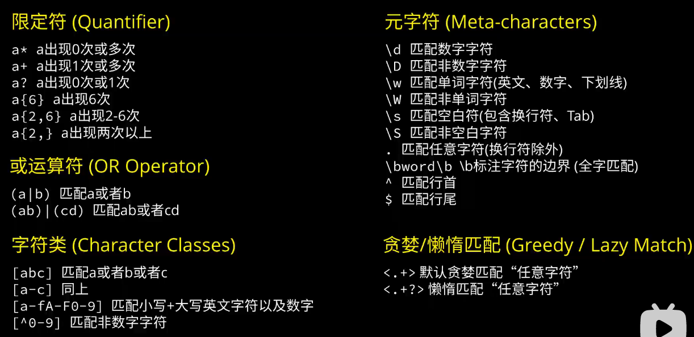

## 限定符  
### **`?`** :匹配0或1次出现的字符  
**表达式**：`ab?c`  
**匹配文本**:  
```
a   
ac         `
abc        `
```
### **`*`** :匹配0次或多次出现的字符  
**表达式**：`ab*c`  
**匹配文本**:  
```
a   
ac         `
abc        `
abbbbc     `
```
### **`+`** :匹配1次或多次出现的字符  
**表达式**：`ab+c`  
**匹配文本**:  
```
a   
ac         
abc        `
abbbbc     `
```
### **`{n}`或`{n1,n2}`** :匹配n次或n1-n2次出现的字符  
**表达式**：`ab{2,}c` *(两次及以上)*   
**匹配文本**:  
```
a   
ac         
abc        
abbc       `
abbbbc     `
```
## 字符组
### **`()`** :匹配字符组  
**表达式**：`(ab)+`  
**匹配文本**:  
```
a   
ac         
abc        `
ababac     `
```  
## 或运算  
### **`|`** :匹配两者之一  
**表达式**：`a (cat|dog)`  
**匹配文本**:  
```
a   
ac         
a cat      `
a dog      `
```  
### **`[…]+`** :匹配含有括号内某些字符的字符组    
**表达式**：`[abc]+`  
**匹配文本**:  
```
a          `
ac         `
mike       
dog        
```  
**表达式**：`[a-z]+`  *(所有小写英文字符，还有0-9，A-Z)*  
**匹配文本**:  
```
a          `
ac         `
mike       `
dog        `
```  
**表达式**：`[^a-z]+`  *(所有****非****小写英文字符，包括换行符)*  
**匹配文本**:  
```
a          `
ac         `
MIKE       `
123        `
```  
## 元字符
### **`\d+`** :匹配数字字符  
### **`\D+`** :匹配`非`数字字符
### **`\w+`** :匹配Unicode单词字符  
### **`\W+`** :匹配`非`Unicode单词字符
### **`\s`**  :匹配空白字符 *(包括制表符和换行符)*    
### **`\S`**  :匹配`非`空白字符 *(包括制表符和换行符)*  
### **`.`**  :匹配任意字符 *(不包括换行符)*  
### **`^m`**  :匹配行首字符`m`  
### **`m$`**  :匹配行尾字符`m`  
### **`\.`**  :转义匹配元字符`.`  
## 贪婪匹配和懒惰匹配  
### 贪婪匹配：尝试匹配尽可能长的字符串(一般都是贪婪模式)
### 懒惰匹配：尝试匹配尽可能短且满足要求的字符串
#### **`<.*>`**  :匹配含有`<>`的任意字符组  
**表达式**：`<.*>`    
**匹配文本**:  
```
<span><b>This is a sample text</b></span>
```  
此时会全部匹配 `<span><b>This is a sample text</b></span>`  
#### **`<.*？>`**  :匹配含有`<>`的任意字符组，且尽可能短  
**表达式**：`<.*？>`    
**匹配文本**:  
```
<span><b>This is a sample text</b></span>
```  
此时只会匹配`<span>` `<b>` `</b>` `</span>`  
## 总结
